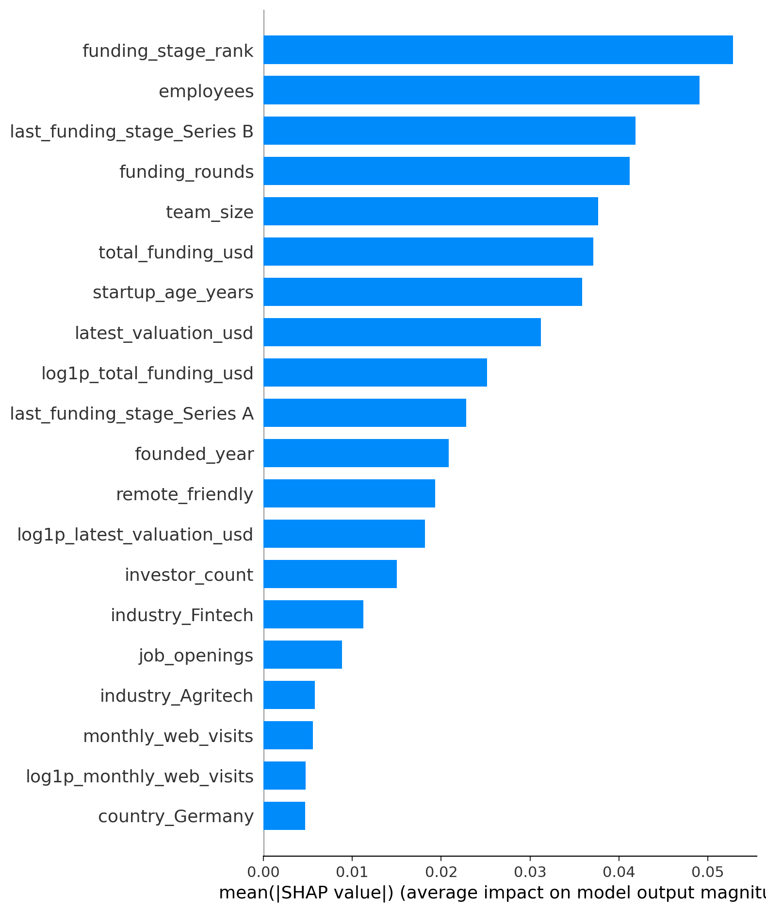
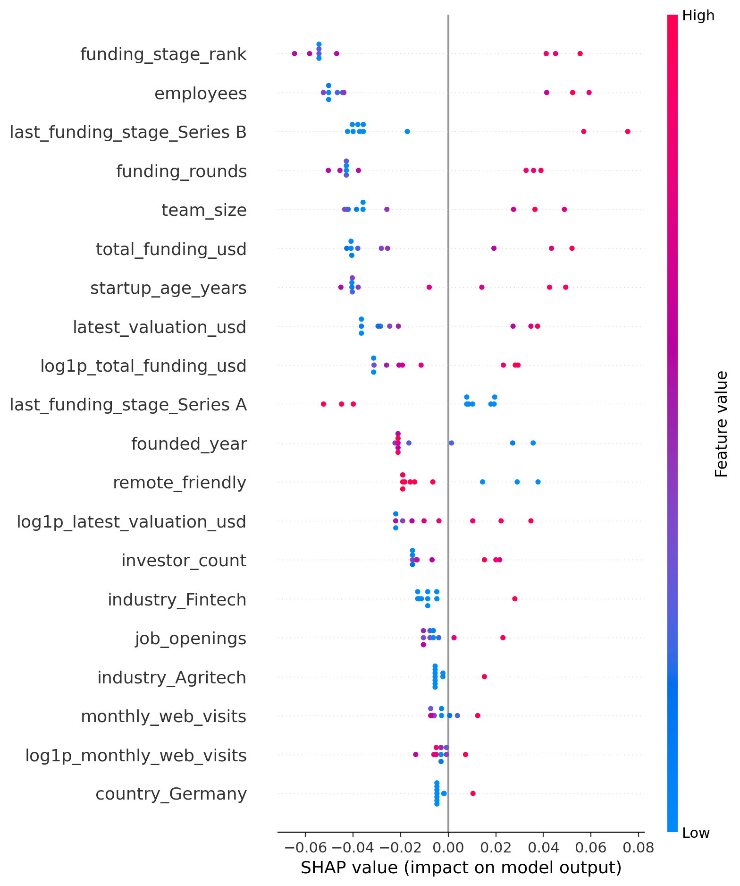

# Predicting Startup Success Using ML

Machine learning pipeline to predict startup success using Crunchbase, AngelList, and PitchBook-style data.

## CI Status
[](https://github.com/admossie/Predicting-Startup-Success-Using-ML/actions/workflows/ci.yml)

## Prerequisites
- Python 3.9+
- pip
- Git

## Installation
```powershell
py -3.9 -m venv .venv
.\.venv\Scripts\Activate.ps1
pip install -r requirements.txt
```

## Project Structure
- `build_dataset.py` - merges source datasets into one unified table.
- `prepare_data.py` - tidying, EDA, missing handling, outlier treatment, feature engineering.
- `train_baseline.py` - baseline modeling with diagnostics.
- `select_final_model.py` - multi-model tuning and final model selection.
- `predict_startup.py` - inference script to score new startup records.
- `run_shap_analysis.py` - SHAP explainability pipeline.

## Key Data Files
- `data/processed/startup_dataset.csv`
- `data/processed/startup_dataset_cleaned.csv`
- `data/processed/startup_dataset_baseline_ready.csv`
- `data/processed/new_startups_to_score.csv`

## Run End-to-End
```bash
python build_dataset.py
python prepare_data.py
python train_baseline.py
python select_final_model.py
```

## Score New Startups
```bash
python predict_startup.py --input data/processed/new_startups_to_score.csv --output reports/new_startup_predictions.csv
```

## SHAP Explainability
```bash
python run_shap_analysis.py
```

This generates:
- `reports/shap_feature_importance.csv` (global SHAP importance)
- `reports/shap_local_explanations.csv` (row-level top contributors)
- `reports/shap_report.md` (SHAP summary report)

## SHAP Visuals
### Global Feature Importance (Bar)


### Feature Impact Distribution (Beeswarm)


## How to Interpret SHAP Plots
- Bar plot (`shap_summary_bar.png`): higher bar = more important feature overall (global impact).
- Beeswarm plot (`shap_summary_beeswarm.png`): each dot is one startup; horizontal position shows whether the feature pushes prediction lower (left) or higher (right).
- Dot color in beeswarm: low feature value (blue) to high feature value (red), which helps explain direction of effect.
- Features at the top are generally the strongest drivers of success probability.
- Use this with `reports/shap_local_explanations.csv` to explain individual startup predictions.

## Tests
```powershell
pytest -q
```

Run functional tests only:
```powershell
pytest -q -m functional
```

## Outputs
- Selected model: `models/final_model.joblib`
- Model metadata: `models/final_model_metadata.json`
- Selection leaderboard: `reports/model_selection_leaderboard.csv`
- New predictions: `reports/new_startup_predictions.csv`
- Model selection report: `reports/model_selection_report.md`
- SHAP report: `reports/shap_report.md`

## Project Conclusion
- Built a full ML pipeline for startup success prediction: data integration, preparation, baseline models, tuning, selection, inference, and explainability.
- Final selected model: `ExtraTrees` (saved in `models/final_model.joblib`) using multi-model comparison with hyperparameter tuning.
- Most influential global drivers from SHAP include `funding_stage_rank`, `employees`, `funding_rounds`, `team_size`, and `total_funding_usd`.
- Inference workflow is production-ready for CSV scoring via `predict_startup.py`.
- Current dataset is very small (10 rows), so results are directional; model confidence should improve with larger real-world data.

## License
MIT © 2026 admossie